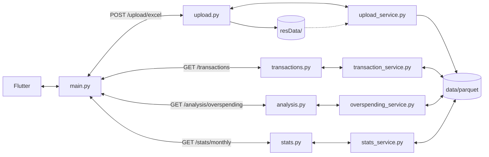

## 디렉토리 트리
    backend/
    ├── app/
    │   ├── main.py                         # FastAPI 앱 진입점
    │   ├── routers/        
    │   │   ├── upload.py                   # POST /upload/excel
    │   │   ├── transactions.py             # GET /transactions/
    │   │   ├── analysis.py                 # GET /analysis/overspending
    │   │   └── stats.py                    # GET /stats/monthly
    │   └── service/        
    │       ├── upload_service.py           # 엑셀 → Parquet 변환
    │       ├── transaction_service.py      # 거래내역 조회
    │       ├── overspending_service.py     # 과소비 분석
    │       └── stats_service.py            # 월별 통계
    ├── config.py                           # 경로 설정
    ├── logger.py                           # 로깅 설정
    ├── resData/                            # 원본 엑셀 파일   
    ├── data/                               # 변환된 데이터       
    ├── logs/                               # 로그 파일
    ├── README.md                           # 프로젝트 문서
    ├── requirements.txt                    # 의존성 목록
    └── venv_guide.txt                      # 가상환경 가이드

## API별 흐름

## 서버 실행
    cd backend
    .\venv\Scripts\activate
    uvicorn app.main:app --reload --host 0.0.0.0 --port 8000

    Swagger UI: http://localhost:8000/docs

## TEST 방법
    cd backend
    .\venv\Scripts\activate

    # 전체 테스트 실행
    pytest

    # 상세 출력
    pytest -v

    # 특정 파일만 실행
    pytest test/test_upload.py